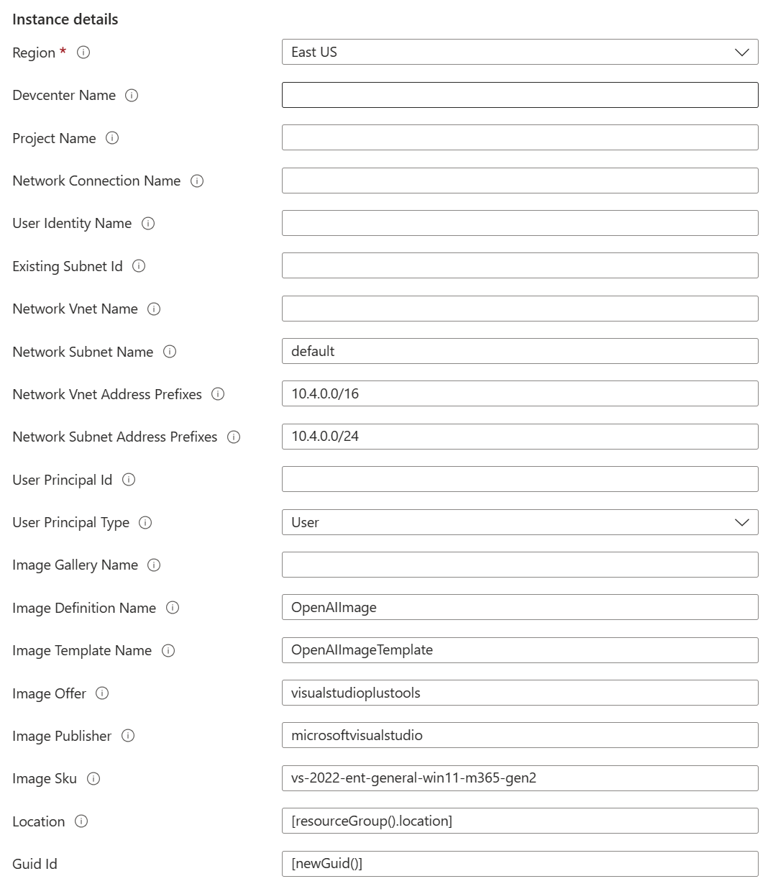

# Deploy a Dev Box service with customized iamge

This template deploys a Dev Box service with customized image.

## How to deploy 
Click the "Deploy to Azure" button to deploy. There will be the deployment page as below:

For **Devcenter Name**, **Project Name**, **Network Connection Name**, **User Identity Name**, **Network Vnet Name**, **Image Gallery Name**, you can keep them blank and the template will generate the related name accordingly. Of course, you can change your own name if you like.

**Existing Subnet Id**: If you want to use your existing subnet, please input your subnet resource id. The template won't create new Virtual network and subnet if existing subnet id is proided.

**Uer Principal Id**: The AAD user id or gorup id that will be granted the role "Devcenter Dev Box User". Please find the user/group's object id under Azure Active Directory. If you don't provide this permission, the developer will not get the permission to access the project in the [Dev Portal](https://devportal.microsoft.com). If it's not provided, mannually you can also go to the project IAM and grant the related permissioin. Please refer to [here](https://learn.microsoft.com/en-us/azure/dev-box/quickstart-configure-dev-box-service?tabs=AzureADJoin#6-provide-access-to-a-dev-box-project).

**Uer Principal Type**: If you want to grant the permission to AAD group, please select "group" instead of "user"

## Customize your own software and tools 
If you want to add your own software and tools, please fork this repo and change the customizedCommand in the core/gallery.bicep

